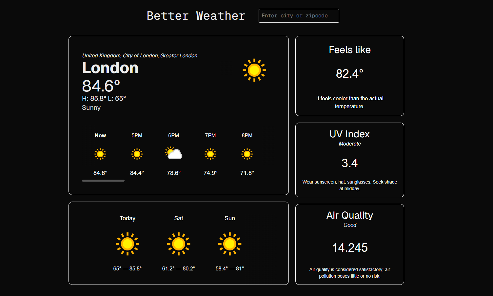

# Better Weather 

A fast, minimalist weather app built with **Next.js**. It fetches current and forecast data from **WeatherAPI.com**, caches results in **Upstash Redis** for speed, and uses a **token-bucket rate limiter** (also backed by Upstash) to protect the API. Users can search by **city or ZIP code**, and the UI displays the essentials: current conditions, hourly temps, multi-day forecast, feels-like, UV index, and air quality.

> **Live Demo:** [https://better-weather-evgm.vercel.app/](https://better-weather-evgm.vercel.app/)  
> 

---

##  Features

-  Search by **city name** or **ZIP code**
-  **Rate limiting** to prevent abuse (configurable window & max requests)
-  Server filters & formatting to return **clean, typed** weather data
-  Polished, **dark-themed** UI (Next.js + Tailwind)
-  Responsive layout with hourly and 3-day forecast cards

---

##  Tech Stack

- **Framework:** Next.js (App Router)
- **Styling:** Tailwind CSS
- **Cache & Ratelimit:** Upstash Redis (REST API)
- **Weather Data:** WeatherAPI.com
- **Deployment:** Vercel

---


##  Getting Started (Local Development)

### 1. Clone the repository

```bash
git clone https://github.com/vconti1/better-weather.git
cd better-weather
```

### 2. Install dependencies
```bash
npm install
# or: yarn
```

### 3. Set up environment variables
Create a `.env.local` file in the project root and add:
```bash
WEATHER_API_KEY=your_weatherapi_key
UPSTASH_REDIS_REST_URL=your_upstash_url
UPSTASH_REDIS_REST_TOKEN=your_upstash_token
```

### 4. Run the development server
```bash
npm run dev
```
Open **http://localhost:3000** in your browser.

---

- [WeatherAPI.com](https://www.weatherapi.com) — Weather data  
- [Upstash Redis](https://upstash.com) — Cache & rate limit  
- Built with [Next.js](https://nextjs.org) + [Tailwind CSS](https://tailwindcss.com)
